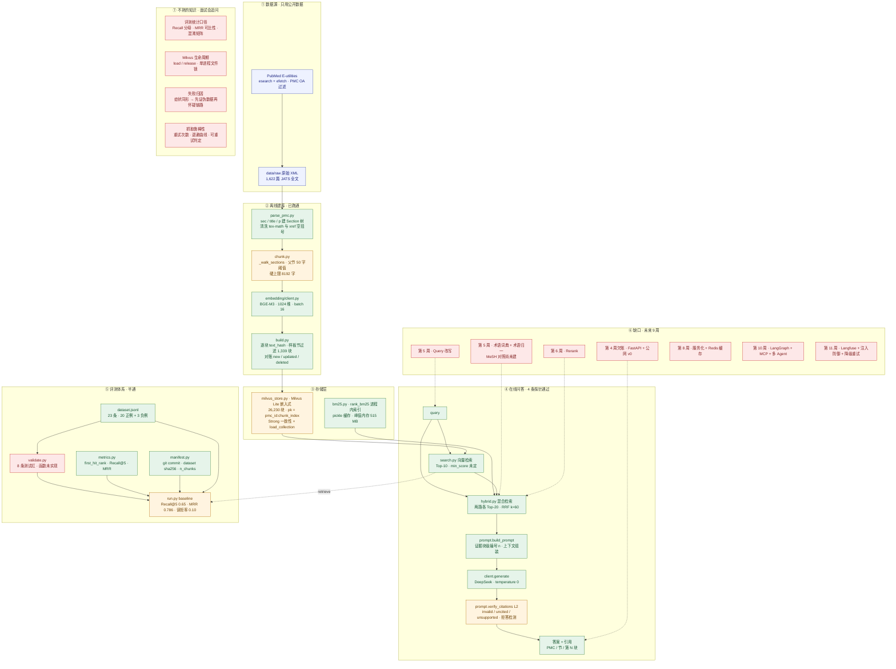

```mermaid
flowchart TB
  subgraph L1["① 数据源 · 只用公开数据"]
    A1["PubMed E-utilities<br/>esearch + efetch · PMC OA 过滤"]
    A2["data/raw 原始 XML<br/>1,622 篇 JATS 全文"]
  end

  subgraph L2["② 离线建库 · 已跑通"]
    B1["parse_pmc.py<br/>sec / title / p 建 Section 树<br/>清洗 tex-math 与 xref 空括号"]
    B2["chunk.py<br/>_walk_sections · 父节 50 字阈值<br/>硬上限 8192 字"]
    B3["embedding/client.py<br/>BGE-M3 · 1024 维 · batch 16"]
    B4["build.py<br/>逐块 text_hash · 样板节过滤 1,339 块<br/>对账 new / updated / deleted"]
  end

  subgraph L3["③ 存储层"]
    C1["milvus_store.py · Milvus Lite 嵌入式<br/>26,230 块 · pk = pmc_id:chunk_index<br/>Strong 一致性 + load_collection"]
    C2["bm25.py · rank_bm25 进程内索引<br/>pickle 缓存 · 峰值内存 515 MB"]
  end

  subgraph L4["④ 在线问答 · 4 条探针通过"]
    D1["query"]
    D2["search.py 向量检索<br/>Top-10 · min_score 未定"]
    D3["hybrid.py 混合检索<br/>两路各 Top-20 · RRF k=60"]
    D4["prompt.build_prompt<br/>证据块级编号 n · 上下文组装"]
    D5["client.generate<br/>DeepSeek · temperature 0"]
    D6["prompt.verify_citations L2<br/>invalid / uncited / unsupported · 拒答检测"]
    D7["答案 + 引用<br/>PMC / 节 / 第 N 块"]
  end

  subgraph L5["⑤ 评测体系 · 半通"]
    E5["dataset.jsonl<br/>23 条 · 20 正例 + 3 负例"]
    E1["validate.py<br/>8 条测试红 · 函数未实现"]
    E2["metrics.py<br/>first_hit_rank · Recall@5 · MRR"]
    E3["run.py baseline<br/>Recall@5 0.65 · MRR 0.786 · 误拒率 0.10"]
    E4["manifest.py<br/>git commit · dataset sha256 · n_chunks"]
  end

  subgraph L6["⑥ 缺口 · 未来 9 周"]
    F1["第 5 周 · 术语词典 + 术语归一<br/>MeSH 对照尚未建"]
    F2["第 5 周 · Query 改写"]
    F3["第 4 周欠账 · FastAPI + 公网 v0"]
    F4["第 6 周 · Rerank"]
    F5["第 8 周 · 服务化 + Redis 缓存"]
    F6["第 10 周 · LangGraph + MCP + 多 Agent"]
    F7["第 11 周 · Langfuse + 注入防御 + 降级重试"]
  end

  subgraph L7["⑦ 不熟的知识 · 面试会追问"]
    G1["评测统计口径<br/>Recall 分母 · MRR 可比性 · 混淆矩阵"]
    G2["Milvus 生命周期<br/>load / release · 单进程文件锁"]
    G3["失败归因<br/>症状同形 → 先证伪数据再怀疑链路"]
    G4["抓取鲁棒性<br/>重试次数 · 退避曲线 · 可重试判定"]
  end

  A1 --> A2
  A2 --> B1
  B1 --> B2
  B2 --> B3
  B3 --> B4
  B4 --> C1

  D1 --> D2
  D1 --> D3
  C1 --> D2
  C2 --> D3
  D2 --> D3
  D3 --> D4
  D4 --> D5
  D5 --> D6
  D6 --> D7

  E5 --> E1
  E1 --> E3
  E2 --> E3
  E4 --> E3
  E5 --> E3
  D2 -.->|retrieve| E3

  F1 -.-> D3
  F2 -.-> D1
  F3 -.-> D7
  F4 -.-> D3

  classDef src fill:#eef2ff,stroke:#3949ab,stroke-width:1px,color:#1a237e
  classDef done fill:#e6f4ea,stroke:#2e7d32,stroke-width:1px,color:#14532d
  classDef warn fill:#fff4e0,stroke:#b26a00,stroke-width:1px,color:#6b3f00
  classDef gap fill:#fde8e8,stroke:#c62828,stroke-width:1px,color:#7f1d1d

  class A1,A2 src
  class B1,B3,B4,C2,D1,D2,D3,D4,D5,D7,E2,E4,E5 done
  class B2,C1,D6,E3 warn
  class E1,F1,F2,F3,F4,F5,F6,F7,G1,G2,G3,G4 gap
```

